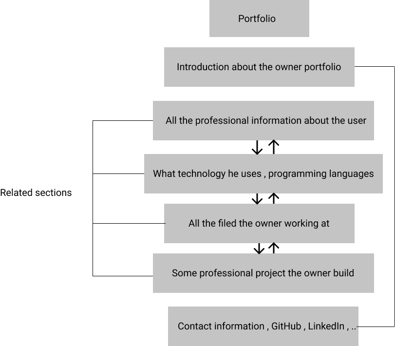
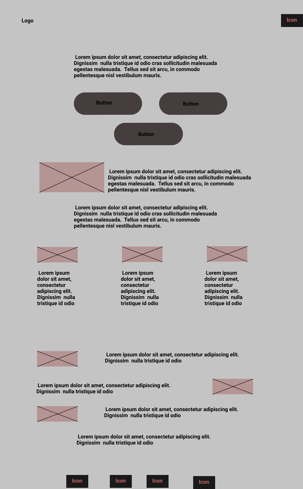

# personal portfolio

The project is building a personal portfolio 

## User Story 
---
The project is building a personal portfolio as a user I want need to put
the most important information , experience , technology I use , show some of my
projects and my contact information 

## Visitor Story 
---
As a visitor , I want to know all the information about the user , 
what project he builds and what technology he knows and how to contact the person 

---

## WIREFRAME

---

## 0.Setup

#### As user , I will see a repo with  readme file

* Fork the template `Agile/html-CSS starter` 
* Turn on GitHub pages
* Create a project-board `Portfolio-project-board`
* Write the project planning
* Create an issue per step 
---
#### As a user I will see the html , css and js file with the project planning 
#### As a vistor , I will see the hope page of the portfolio 
### 1-Index

#### This user story is developed on branch `1-index`.
#### This branch is merged to `master` branch after completion.

*  Create a branch `1-index`
*  Add code to `index.html `
    - add meta tags , links to css and js file
    - create a container for the logo and navigation bar
    - add the logo and navigation bar 
    - Add home part tags
    - add herder 2 
    - add paragraph 
    - add header and paragraph 
    - add images and icons
    - add different buttons 
*   Add and commit `index.html`
*   Push it to GitHub
*  Checkout master and then merge `1-index`

### 2-style

#### This user story is developed on branch `2-style`.
#### This branch is merged to `master` branch after completion.

*  Create a branch `2-style`
*  Add code to `style.css `
    - import google fonts
    - add general style to the body , margin,padding , font size ,background color
    - format the a links and the hover state 
    - format the images
    - format the logo and navigation bar 
    - format the home part , p and header 2 
    - format the buttons 
    - format about part format p 
    - format services part 
    - format header2 , p and images 
    - format projects part , p , header 2 and images
    - format project links 
    - format contact part , p , header2 and icons 
    - format the footer , p and icons 
    - add media queries 
*   Add and commit `style`
*   Push it to GitHub
*  Checkout master and then merge `2-style`

### 3-main

 #### This user story is developed on branch `3-main`.
 #### This branch is merged to `master` branch after completion.

*  Create a branch `3-main`
*  Add code to `main.js `
    - add functionality to navigation bar      
*   Add and commit `main`
*   Push it to GitHub
*  Checkout master and then merge `3-main`
  

### 4-Final touches

- Fix the errors 
- Make sure, everything is working properly 

---
